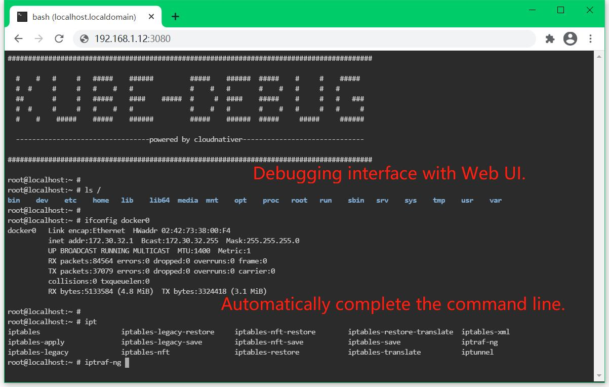

A toolbox for debugging Docker container and Kubernetes with visual web UI.


# [1] Quick start

<br>

## 1.1 Download kube-install package file

<br>

You can download the `kube-debug-*.tgz` package from https://github.com/cloudnativer/kube-debug/releases.<br>

For example, we have downloaded the `kube-debug-x86-v0.1.0.tgz` package.<br>


```
# cd ~/
# wget https://github.com/cloudnativer/kube-debug/releases/download/v0.1.0/kube-debug-x86-v0.1.0.tgz
# tar -zxvf kube-debug-x86-v0.1.0.tgz
# cd ~/kube-debug/
```

<br>

## 1.2 Initialize the kube-debug environment

<br>
Execute the following command to initialize the local debug environment: <br>

```
# cd ~/kube-debug/
# ./kube-debug -init
```

<br>

## 1.3 Start debugging

<br>

You can use `kube-debug` to debug the local host, the local container, any kubernetes node and any kubernetes pod of any namespace.<br>

For example, We can use `kube-debug -localhost` to debug the local host. Let's debug the local host , We can perform the following command operations:<br>


```
# cd ~/kube-debug/
# ./kube-debug -localhost
```

After the command is executed, the following information will be displayed:

```
df02e84f5233e01309f3188d3ab5622df1c495d0c8b5f2c68247856d9c552625

Notice: You can now enter the debugging interface in the following two ways:
        (1) Using a web browser to access http://Localhost's_IP:3080 Debug! (Recommended URL: http://192.168.1.12:3080)
        (2) Use the command to debug directly on the local host: docker exec -it kube-debug-localhost /bin/bash 
```

Now you can use a web browser to access `http://192.168.1.12:3080` and enter the visual web ui for debugging.



```
 __________________
|  Web Browser UI  |
=============================================================================================================
=====| <- | -> | O |=====(  http://192.168.1.12:3080                                        )================
=============================================================================================================
|                                                                                                         | |
|  ##########################################################################################             | |
|                                                                                                         | | 
|    #    #   #     #   #####    ######         #####    ######  #####    #     #    #####                | |
|    #  #     #     #   #    #   #              #    #   #       #    #   #     #   #                     | |
|    ##       #     #   #####    ####    #####  #     #  ####    #####    #     #   #   ###               | |
|    #  #     #     #   #    #   #              #    #   #       #    #   #     #   #     #               | |
|    #    #    #####    #####    ######         #####    ######  #####     #####     ######               | |
|                                                                                                         | |
|    --------------------------------Powered By Cloudnativer-------------------------------               | |
|                                                                                                         | |
|  ##########################################################################################             | |
|  root@localhost:~ #                                                                                     |||
|  root@localhost:~ #                                                                                     |||
|  root@localhost:~ #                                                                                     |||
|  root@localhost:~ # iptraf-ng |                                                                         | |
=============================================================================================================
```

Here we can easily do visual debugging, Automatically complete the command line, Rich visual debugging tools:


For more tool list information of `kube-debug` integration , <a href="docs/toollist.md">please click this link</a>.<br>

In addition, we can also use the `docker exec -it kube-debug-localhost /bin/bash` command to directly log in to the debugging container for debugging.

```
[root@localhost ~]# docker exec -it kube-debug-localhost /bin/bash
##########################################################################################

  #    #   #     #   #####    ######         #####    ######  #####    #     #    #####
  #  #     #     #   #    #   #              #    #   #       #    #   #     #   #
  ##       #     #   #####    ####    #####  #     #  ####    #####    #     #   #   ###
  #  #     #     #   #    #   #              #    #   #       #    #   #     #   #     #
  #    #    #####    #####    ######         #####    ######  #####     #####     ######

  --------------------------------Powered By Cloudnativer-------------------------------

##########################################################################################
root@localhost:~ # 
root@localhost:~ # 
root@localhost:~ # 
root@localhost:~ # 
```

<br>
<br>

# [2] How to debug?

<br>

## 2.1 Debug the local host
<br>

We can use `kube-debug -localhost` to debug the local host. Let's debug the local host , We can perform the following command operations:<br>

```
# cd ~/kube-debug/
# ./kube-debug -localhost
```

After the command is executed, the following information will be displayed:

```
df02e84f5233e01309f3188d3ab5622df1c495d0c8b5f2c68247856d9c552625

Notice: You can now enter the debugging interface in the following two ways:
        (1) Using a web browser to access http://Localhost's_IP:3080 Debug! (Recommended URL: http://192.168.1.12:3080)
        (2) Use the command to debug directly on the local host: docker exec -it kube-debug-localhost /bin/bash 
```

Now you can use a web browser to access `http://192.168.1.12:3080` and enter the Visual Web UI for debugging. You can also use the `docker exec -it kube-debug-localhost /bin/bash` command to directly log in to the debugging container for debugging.<br>

<br>

## 2.2 Debug the local container

<br>

We can use `kube-debug -container <container id or container name>` to debug the local container. Let's debug the local container with ID `9a64c7a0d6bd` , We can perform the following command operations:<br>

```
# cd ~/kube-debug/
# ./kube-debug -container "a1aa35697643" -debugport 38080
```

After the command is executed, the following information will be displayed:

```
efa3cc35dd414e4217c880fe269f375cd512fe4f5122e0ccc39719c83d8c30e1

Notice: You can now enter the debugging interface in the following two ways:
        (1) Using a web browser to access http://Localhost's_IP:38080 Debug! (Recommended URL: http://192.168.1.12:38080) 
        (2) Use the command to debug directly on the local host: docker exec -it kube-debug-container-a1aa35697643 /bin/bash 
```

Now you can use a web browser to access `http://192.168.1.12:38080` and enter the Visual Web UI for debugging. You can also use the `docker exec -it kube-debug-container-a1aa35697643 /bin/bash` command to directly log in to the debugging container for debugging.<br>

<br>

## 2.3 Debug the any kubernetes node

<br>

We can use `kube-debug -node <kubernetes node IP>` to debug any kubernetes node. Let's debug the kubernetes node with IP `192.168.1.12` , We can perform the following command operations:<br>

```
# cd ~/kube-debug/
# ./kube-debug -node "192.168.1.13" -debugport 38081
```

After the command is executed, the following information will be displayed:

```
Preparing kube-debug environment, Please wait... 

Loaded image: cloudnativer/kube-debug:v0.1.0

kube-debug Debugging environment initialization completed!

0d1e548b7f6012dea80e2ccadb8b6ba874fcf20a1a4b914469093e88f85905e3

Notice: You can now enter the debugging interface in the following two ways:
        (1) Using a web browser to access http://k8s-node's_IP:38081 Debug! (Recommended URL: http://192.168.1.13:38081)
        (2) Login to the target k8s-node host (192.168.1.13), debugging with commands: docker exec -it kube-debug-node-192.168.1.13 /bin/bash 
```

Now you can use a web browser to access `http://192.168.1.13:38081` and enter the Visual Web UI for debugging. You can also Login to the target k8s-node host (192.168.1.13), debugging with commands `docker exec -it kube-debug-node-192.168.1.13 /bin/bash` .<br>

<br>

## 2.4 Debug the any kubernetes pod

<br>

We can use `kube-debug -pod <pod name> -namespace <namespace> -kubeconfig <kubeconfig file>` to debug any kubernetes pod. Let's debug the `test-6bfb69dc64-hdblq` pod in the `testns` namespace , We can perform the following command operations:<br>

```
# cd ~/kube-debug/
# ./kube-debug -pod "test-6bfb69dc64-hdblq" -namespace "testns" -kubeconfig "/etc/kubernetes/pki/kubectl.kubeconfig" -debugport 38082
```

After the command is executed, the following information will be displayed:

```
Preparing kube-debug environment, Please wait... 

Please wait and enter the password of the target k8s-node host,
root@192.168.122.52's password: <Enter Password>
Loaded image: cloudnativer/kube-debug:v0.1.0

kube-debug Debugging environment initialization completed!

4d6b52c485c4c9a5c10c2dffc2c322562acfee6ca73d3e94fd893efddfe36a91

Notice: You can now enter the debugging interface in the following two ways:
        (1) Using a web browser to access http://k8s-node's_IP:38082 Debug! (Recommended URL: http://192.168.1.15:38082)
        (2) Login to the target k8s-node host (192.168.1.15), debugging with commands: docker exec -it kube-debug-pod-test-6bfb69dc64-hdblq /bin/bash 
```

Now you can use a web browser to access `http://192.168.1.15:38082` and enter the Visual Web UI for debugging. You can also Login to the target k8s-node host (192.168.1.15), debugging with commands `docker exec -it kube-debug-pod-test-6bfb69dc64-hdblq /bin/bash` .

<br>
<br>

# [3] Cleaning up the debug environment

<br>

We can clean up the local machine's debug environment by executing `kube-debug -clear` . The following command will automatically clean up the residual temporary cache file, debug container, debug process and other information.<br>

```
# cd ~/kube-debug/
# ./kube-debug -clear
```

Now the debug environment of the local machine is cleaned up.

<br>
<br>


# [4] Parameter introduction

<br>

The parameters about kube-debug can be viewed using the `kube-debug -help` command. You can also <a href="docs/parameters.md">see more detailed parameter introduction here</a>.

<br>
<br>

# [5] Integrated tool list

<br>

For more tool list information of `kube-debug` integration , <a href="docs/toollist.md">please click this link</a>.

<br>
<br>

# [6] How to build it?

<br>

The build can be completed automatically by executing the `make` command. You can also <a href="docs/build.md">see more detailed build instructions here</a>.<br>

<br>
<br>
<br>
